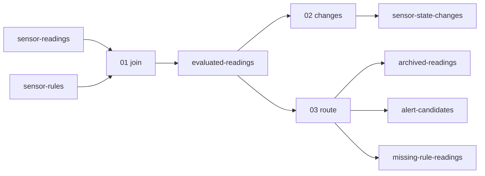

# kafka-streams-patterns

스트림-테이블 조인, 상태 기반 집계, 이벤트 분기를 예제로 배우는 Kafka Streams.
가상의 온도 센서 데이터를 사용하며 Java 코드, 테스트, 실행 결과를 함께 살펴봅니다.

## 예제

| 예제 | 주요 API | 배우는 내용 |
| --- | --- | --- |
| [01. 센서별 규칙 조인](docs/01-stream-table-join.md) | `KStream`, `GlobalKTable`, `leftJoin` | 변경되는 기준 데이터를 측정값에 적용 |
| [02. 상태 변경 감지](docs/02-state-change.md) | `groupByKey`, `aggregate`, `toStream`, `filter` | 센서별 이전 심각도를 기억하고 변경 시에만 출력 |
| [03. 이벤트 생성·분기](docs/03-event-routing.md) | `flatMap`, `split`, `branch` | 측정값을 보관하고 목적별 이벤트를 별도 토픽으로 전달 |

## 개발 환경

- JDK 21, Maven 3.9 이상
- Kafka Streams 및 로컬 브로커: **4.1.1**로 고정
- 실제 Kafka 실행: Docker와 Docker Compose v2

토폴로지는 Spring 없이 Kafka Streams API로 작성합니다. `JsonSerde`는 Java record와 JSON을 변환합니다.
JSON 필수 필드 누락과 잘못된 임계치는 실패로 처리합니다. 운영용 오류 격리/DLQ 정책은 별도로 설계해야 합니다.

## Kafka 없이 테스트

```bash
mvn verify
```

`TopologyTestDriver`가 조인, 상태 변경, 이벤트 분기, 샘플 출력과 예제 간 연결을 검증합니다. 실제 브로커의 리밸런싱, 장애 복구,
파티션 간 순서와 트랜잭션은 이 테스트만으로 검증하지 못합니다.

## Kafka에서 실행

저장소 루트에서 실행합니다. 아래는 01번 실행 절차입니다.
02번은 [상태 변경 감지](docs/02-state-change.md#단독-실행),
03번은 [이벤트 생성·분기](docs/03-event-routing.md#단독-실행)의 절차를 따릅니다.

```bash
docker compose up -d --wait
bash scripts/create-topics.sh
# 테이블을 먼저 채우고 앱을 시작하면 시작 시 규칙이 복원됩니다.
bash scripts/produce.sh sensor-rules < samples/rules.txt
mvn package
java -jar target/kafka-streams-patterns.jar join
```

다른 터미널에서 측정값을 전송하고 결과를 읽습니다.

```bash
bash scripts/produce.sh sensor-readings < samples/readings.txt
bash scripts/consume.sh evaluated-readings
```

출력 예시(센서 간 순서는 달라질 수 있습니다):

```text
sensor-1|{"temperature":50.0,"severity":"NORMAL"}
sensor-1|{"temperature":75.0,"severity":"WARNING"}
sensor-1|{"temperature":90.0,"severity":"CRITICAL"}
sensor-2|{"temperature":75.0,"severity":"NORMAL"}
sensor-3|{"temperature":75.0,"severity":"NO_RULE"}
```

앱과 소비자는 `Ctrl+C`로 종료합니다. 브로커만 잠시 중지하려면 `docker compose stop`을 사용합니다.
다시 시작하려면 `docker compose start`를 실행합니다.

### 예제 선택과 연결

| 실행 인자 | application.id | 입력 | 출력 |
| --- | --- | --- | --- |
| `join` | `patterns-join-v1` | sensor-readings, sensor-rules | evaluated-readings |
| `changes` | `patterns-changes-v1` | evaluated-readings | sensor-state-changes |
| `route` | `patterns-route-v1` | evaluated-readings | archived-readings, alert-candidates, missing-rule-readings |

02·03번은 `samples/evaluated-readings.txt`로 독립 실행할 수 있습니다.
세 앱을 별도 터미널에서 실행하면 01번의 결과를 02·03번이 각각 소비합니다.
02번은 반복 상태를 억제하고, 03번은 모든 측정값을 보관하므로 서로 직렬로 연결하지 않습니다.



### 설정과 데이터 초기화

| 환경 변수 | 기본값 | 용도 |
| --- | --- | --- |
| `BOOTSTRAP_SERVERS` | `localhost:9092` | 접속할 Kafka 브로커 |
| `STATE_DIR` | `.state` | 로컬 상태 저장 경로 |

동일한 `application.id`로 재시작하면 저장된 오프셋부터 처리합니다.
샘플 재전송은 새로운 레코드를 추가하고, 소비 스크립트는 이전 출력도 함께 표시합니다.
로컬 실습 데이터를 완전히 초기화하려면 앱/소비자를 종료한 뒤 아래를 실행합니다.
**이 명령은 이 Compose 브로커의 모든 토픽 데이터와 로컬 예제 상태를 삭제합니다.**

```bash
docker compose down -v
rm -rf .state
```

이후 처음의 실행 절차를 다시 진행합니다. 기존 브로커에 연결한 상태에서 로컬 상태만 지워
처음부터 재처리하려고 하지 마세요. 소비 오프셋과 내부 토픽도 함께 고려해야 합니다.

## 참고 자료

- [Apache Kafka: Streams DSL](https://kafka.apache.org/41/streams/developer-guide/dsl-api/)
- [Apache Kafka: Testing a Streams Application](https://kafka.apache.org/41/streams/developer-guide/testing/)
- [Apache Kafka: Docker](https://kafka.apache.org/41/getting-started/docker/)
