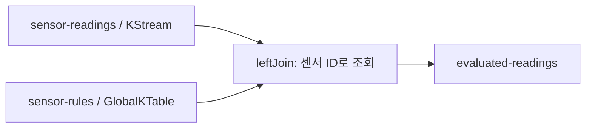

# 01. 측정값에 센서별 규칙 적용하기

온도 측정값은 계속 도착하고, 경고·위험 기준은 센서마다 다르며 변경될 수 있습니다.
측정값마다 외부 저장소를 조회하는 대신, 규칙 토픽으로 로컬 테이블을 유지하고 조인합니다.



## 입력과 출력

키는 모두 센서 ID입니다. 값은 JSON이며 임계치 이상이면 해당 상태로 판정합니다.

| 토픽 | 값 예시 | 의미 |
| --- | --- | --- |
| `sensor-readings` | `{"temperature":75}` | 새로운 측정값 |
| `sensor-rules` | `{"warning":60,"critical":80}` | 해당 센서의 규칙 교체 |
| `evaluated-readings` | `{"temperature":75.0,"severity":"WARNING"}` | 규칙을 적용한 결과 |

## 핵심 코드

[RuleJoinTopology.java](../src/main/java/dev/ggjang/streams/RuleJoinTopology.java)

```java
.leftJoin(rules,
        (sensorId, reading) -> sensorId,
        (reading, rule) -> new EvaluatedReading(reading.temperature(),
                rule == null ? Severity.NO_RULE : rule.evaluate(reading.temperature())))
```

`KStream`은 각각의 측정 이벤트를 처리합니다. `GlobalKTable`은 같은 키의 값이 도착할 때
기존 규칙을 교체합니다. 모든 인스턴스가 전체 규칙을 보유하므로 이 조인에 입력 토픽의
동일 파티션 배치(co-partitioning)가 필요하지 않습니다. 출력 키는 측정값의 센서 ID를 유지합니다.

`leftJoin`으로 규칙이 없는 센서도 출력하며 `NO_RULE`로 표시합니다.
규칙이 없다는 이유로 측정값을 정상으로 간주하거나 버리지 않는 정책입니다.

## 규칙 갱신과 삭제

앱 실행 중 아래 명령으로 규칙을 변경합니다.

```bash
printf '%s\n' 'sensor-1|{"warning":80,"critical":100}' | bash scripts/produce.sh sensor-rules
```

규칙 변경만으로는 결과가 생기지 않습니다. 테이블에 갱신이 반영된 후 들어오는 측정값 75는
`WARNING` 대신 `NORMAL`이 됩니다. **GlobalKTable 갱신과 측정값 처리는 비동기**이므로,
두 토픽에 연이어 전송했다고 반드시 새 규칙이 먼저 반영되지는 않습니다.
실제 실습에서는 결과를 관찰하며 재전송하고, 정확한 갱신 순서는 아래 단위 테스트에서 확인합니다.

```bash
printf '%s\n' 'sensor-1|{"temperature":75}' | bash scripts/produce.sh sensor-readings
```

규칙 토픽에 Kafka null 값(tombstone)을 보내면 규칙이 삭제됩니다.
스크립트의 `NULL` 표기는 프로듀서가 실제 null 바이트 값으로 변환하는 예약 문자열입니다.

```bash
printf '%s\n' 'sensor-1|NULL' | bash scripts/produce.sh sensor-rules
```

삭제가 반영된 이후 측정값은 `NO_RULE`이 됩니다. 삭제도 기존 측정값을 재평가하지 않습니다.

## 테스트와 설계 범위

[RuleJoinTopologyTest.java](../src/test/java/dev/ggjang/streams/RuleJoinTopologyTest.java)는
임계치 경계, 센서별 규칙, 규칙 미등록, 갱신, 삭제, null 입력을 검증합니다.

```bash
mvn -Dtest=RuleJoinTopologyTest test
```

- 전체 규칙이 모든 인스턴스에 복제되므로 규칙 크기만큼 로컬 디스크·메모리·복원 비용이 듭니다.
- 조인은 측정값의 과거 이벤트 시각에 맞는 규칙을 찾는 temporal join이 아닙니다.
  처리 시점에 로컬 테이블에 반영된 규칙을 사용합니다.
- 규칙 토픽은 compaction을 사용합니다. null 값은 삭제이며 null 키는 유효한 규칙 키가 아닙니다.
- 이름 없는 센서(null 키)와 null 측정값은 애플리케이션 필터로 제외합니다.
- 임계치 규칙은 `warning < critical`이고 두 수는 유한해야 합니다.

공식 설명: [KStream–GlobalKTable join](https://kafka.apache.org/41/streams/developer-guide/dsl-api/#kstream-globalktable-join)
