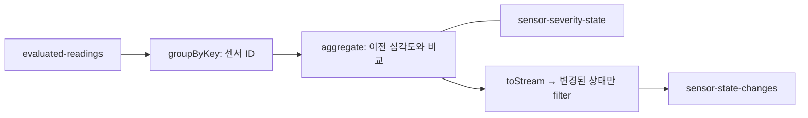

# 02. 센서 상태가 바뀔 때만 출력하기

01번은 측정값마다 현재 규칙으로 심각도를 판정합니다. 같은 WARNING이 계속 들어올 때
알림을 반복하지 않으려면 센서별 이전 심각도를 기억해야 합니다.
이 예제는 최초 상태와 이후의 심각도 변경을 Kafka 토픽으로 출력합니다.



## 처리 정책

- 센서의 최초 입력은 NORMAL과 NO_RULE을 포함해 항상 출력합니다.
- 이후에는 심각도가 바뀔 때만 출력합니다. 온도만 바뀌면 출력하지 않습니다.
- CRITICAL에서 NORMAL로 복구되는 경우도 출력합니다.
- NO_RULE도 하나의 상태입니다. 규칙 삭제·재등록 후 새 측정값이 오면 전환을 감지합니다.
- null 키와 null 값은 무시합니다. null 입력으로 저장된 상태를 삭제하지 않습니다.
- 키는 센서 ID를 유지하고, 출력 값은 01번과 동일한 temperature·severity JSON입니다.

```text
입력: NORMAL → WARNING → WARNING → CRITICAL → NORMAL
출력: NORMAL → WARNING →           CRITICAL → NORMAL
```

## 핵심 코드

[StateChangeTopology.java](../src/main/java/dev/ggjang/streams/StateChangeTopology.java)

`groupByKey().aggregate()`는 센서별 최신 온도와 심각도를 저장하고 변경 여부를 계산합니다.
`initialized`는 최초 입력과 실제 NO_RULE 상태를 구분합니다.
`toStream().filter(...)`는 변경된 상태만 출력합니다. 반복 상태도 저장소의 최신 온도는 갱신합니다.

집계 저장소에는 `withCachingDisabled()`를 적용합니다. 캐시가 여러 갱신을 합치면
WARNING → CRITICAL → NORMAL 같은 중간 전환을 놓칠 수 있기 때문입니다.
저장소 이름과 JSON Serde를 명시하고 changelog는 기본 활성화 상태로 유지합니다.
이 예제의 집계는 합계나 평균 대신 센서별 최신 상태를 누적합니다.

## 단독 실행

저장소 루트에서 실행합니다. 아래 출력은 이 예제를 처음 실행하는 깨끗한 실습 환경 기준입니다.

```bash
docker compose up -d --wait
bash scripts/create-topics.sh
mvn package
java -jar target/kafka-streams-patterns.jar changes
```

다른 터미널에서 판정된 샘플을 직접 전송합니다. 단독 실습에는 01번 앱이 필요하지 않습니다.

```bash
bash scripts/produce.sh evaluated-readings < samples/evaluated-readings.txt
bash scripts/consume.sh sensor-state-changes
```

8개 입력에서 6개 출력이 생깁니다. 센서 간 출력 순서는 달라질 수 있습니다.

```text
sensor-1|{"temperature":50.0,"severity":"NORMAL"}
sensor-1|{"temperature":75.0,"severity":"WARNING"}
sensor-1|{"temperature":90.0,"severity":"CRITICAL"}
sensor-1|{"temperature":50.0,"severity":"NORMAL"}
sensor-2|{"temperature":75.0,"severity":"NO_RULE"}
sensor-2|{"temperature":75.0,"severity":"WARNING"}
```

## 01번과 연결

01번의 `join` 앱과 02번의 `changes` 앱을 별도 터미널에서 실행하면 다음 흐름이 됩니다.

```text
sensor-readings + sensor-rules → join → evaluated-readings → changes → sensor-state-changes
```

이 경우 판정 샘플을 직접 넣는 대신 [README의 01번 실행 절차](../README.md#kafka에서-실행)에 따라
규칙과 원본 측정값을 전송합니다. 두 앱은 각각 `patterns-join-v1`, `patterns-changes-v1`의
application.id를 사용합니다. 기존 evaluated-readings 토픽에 데이터가 있으면 새 changes 앱이
그 데이터도 처리하므로 단독 실습의 출력과 섞일 수 있습니다.

## 테스트와 설계 범위

```bash
mvn -Dtest=StateChangeTopologyTest,ExamplesFlowTest test
mvn verify
```

[StateChangeTopologyTest.java](../src/test/java/dev/ggjang/streams/StateChangeTopologyTest.java)는
최초 상태 4종, 반복 억제와 저장소 갱신, 악화·복구, 센서별 독립성,
NO_RULE 전환, null 입력을 검증합니다.
[ExamplesFlowTest.java](../src/test/java/dev/ggjang/streams/ExamplesFlowTest.java)는
샘플 파일의 예상 출력과 01번 결과를 전달하는 흐름을 검증합니다.

- 같은 센서의 입력은 같은 파티션으로 전달해야 합니다. 센서 ID를 Kafka 키로 사용합니다.
- 비교 기준은 처리 순서입니다. 이벤트 시간 정렬이나 늦게 도착한 데이터 보정은 하지 않습니다.
- 상태는 시간 창 없이 센서별로 유지하며 자동 만료하지 않습니다.
- 동일 application.id로 재시작하면 저장된 오프셋과 상태를 이어 사용합니다.
  초기화는 [README](../README.md#설정과-데이터-초기화)의 절차를 따릅니다.
- 반복 심각도 억제는 장애 시 중복 출력 방지와 다릅니다. 기본 at-least-once 처리이며,
  실제 알림 전송이나 외부 저장소 연동은 포함하지 않습니다.
- TopologyTestDriver는 동기적으로 처리합니다. 실제 브로커의 캐시 동작, 재시작 복원,
  리밸런싱과 장애 시 전달 보장은 이 테스트만으로 검증하지 못합니다.

공식 문서: [집계와 KTable 출력](https://kafka.apache.org/41/streams/developer-guide/dsl-api/),
[Materialized 설정](https://kafka.apache.org/41/javadoc/org/apache/kafka/streams/kstream/Materialized.html).
