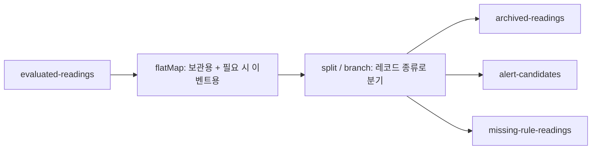

# 03. 측정값에서 이벤트를 만들고 목적별로 분기하기

모든 측정값은 보관하고, WARNING·CRITICAL은 알림 후보로, NO_RULE은 규칙 점검 대상으로
전달하고 싶을 때 사용합니다. 이 예제는 하나의 판정 결과에서 보관용 레코드와 필요에 따른
이벤트 레코드를 만들고, 목적별 Kafka 토픽으로 분기합니다.



## 입력과 출력

| 입력 심각도 | 보관 토픽 | 알림 후보 토픽 | 규칙 누락 토픽 |
| --- | --- | --- | --- |
| NORMAL | 1개 | 없음 | 없음 |
| WARNING | 1개 | 1개 | 없음 |
| CRITICAL | 1개 | 1개 | 없음 |
| NO_RULE | 1개 | 없음 | 1개 |

출력 키는 센서 ID이고, 출력 값은 입력과 동일한 temperature·severity JSON입니다.
여기서 이벤트 종류는 목적지 토픽으로 구분합니다. null 키와 null 값은 모든 출력에서 제외합니다.

## 핵심 코드

[EventRoutingTopology.java](../src/main/java/dev/ggjang/streams/EventRoutingTopology.java)

1. `flatMap`으로 항상 ARCHIVE 레코드를 생성합니다.
2. WARNING·CRITICAL이면 ALERT, NO_RULE이면 MISSING_RULE 레코드를 추가합니다.
3. `split().branch()`로 각 레코드를 종류에 맞는 토픽으로 보냅니다.

`branch`는 처음 일치하는 분기에만 레코드를 전달합니다. 따라서 측정값 하나를 그대로
분기하면 보관과 알림 양쪽으로 보낼 수 없습니다. 먼저 `flatMap`으로 두 레코드를 만든 뒤
분기하는 것이 이 예제의 핵심입니다. 내부의 종류 표시는 출력 전에 제거합니다.

## 단독 실행

저장소 루트에서 실행합니다. 아래 출력은 이 예제를 처음 실행하는 깨끗한 실습 환경 기준입니다.

```bash
docker compose up -d --wait
bash scripts/create-topics.sh
mvn package
java -jar target/kafka-streams-patterns.jar route
```

다른 터미널에서 02번과 같은 샘플을 전송합니다.

```bash
bash scripts/produce.sh evaluated-readings < samples/evaluated-readings.txt
```

각 토픽을 별도 터미널에서 소비하거나, 하나씩 실행하고 Ctrl+C로 종료합니다.

```bash
bash scripts/consume.sh archived-readings
bash scripts/consume.sh alert-candidates
bash scripts/consume.sh missing-rule-readings
```

8개 입력에서 보관 8개, 알림 후보 4개, 규칙 누락 2개가 생깁니다.
보관 토픽에는 모든 입력이 들어갑니다. 알림 후보 출력은 다음과 같습니다.

```text
sensor-1|{"temperature":75.0,"severity":"WARNING"}
sensor-1|{"temperature":77.0,"severity":"WARNING"}
sensor-1|{"temperature":90.0,"severity":"CRITICAL"}
sensor-2|{"temperature":75.0,"severity":"WARNING"}
```

규칙 누락 출력:

```text
sensor-2|{"temperature":75.0,"severity":"NO_RULE"}
sensor-2|{"temperature":76.0,"severity":"NO_RULE"}
```

센서 간 순서는 달라질 수 있습니다. 반복 WARNING도 알림 후보에 포함되며,
상태 변경만 출력하는 02번의 정책은 적용하지 않습니다.

## 01·02번과의 관계

01번의 결과 토픽을 02번과 03번이 각각 소비합니다.

```text
sensor-readings + sensor-rules → join → evaluated-readings
                                           ├→ changes → sensor-state-changes
                                           └→ route   → 보관 / 알림 후보 / 규칙 누락
```

`join`, `changes`, `route`를 별도 터미널에서 실행하고 01번의 원본 측정값을 전송하면 됩니다.
application.id가 각각 달라 02번과 03번이 같은 입력 전체를 독립적으로 처리합니다.
02번 출력 뒤에 03번을 연결하면 반복 측정값이 이미 제거되어 모든 측정값을 보관할 수 없으므로,
이 예제에서는 두 앱이 evaluated-readings를 각각 읽습니다.

02번 단독 실습 때 이미 샘플을 넣었다면 route를 시작할 때 그 기록도 처리합니다.
동일 샘플을 다시 전송하면 보관·이벤트 출력이 추가됩니다. 예상 건수를 비교하려면
[README 초기화 절차](../README.md#설정과-데이터-초기화)를 참고하세요.

## 테스트와 설계 범위

```bash
mvn -Dtest=EventRoutingTopologyTest,ExamplesFlowTest test
mvn verify
```

[EventRoutingTopologyTest.java](../src/test/java/dev/ggjang/streams/EventRoutingTopologyTest.java)는
네 심각도의 목적지·출력 개수, 키와 값 유지, 반복 이벤트 유지, null 입력 제외를 검증합니다.
[ExamplesFlowTest.java](../src/test/java/dev/ggjang/streams/ExamplesFlowTest.java)는
실제 샘플 파일과 01번에서 직렬화한 결과를 입력하여 출력 내용을 검증합니다.

- 상태 저장소를 사용하지 않는 변환·분기 예제입니다.
- 보관은 Kafka 토픽으로 내보내는 것까지이며, 영구 보관소 적재나 실제 알림 발송은 포함하지 않습니다.
- 기본 at-least-once 처리입니다. 여러 토픽 출력의 트랜잭션 원자성은 보장하도록 설정하지 않았습니다.
- JSON 파싱 실패는 기존 JsonSerde의 실패 정책을 따르며, 별도의 DLQ는 만들지 않습니다.
- 테스트는 TopologyTestDriver 기반이며 실제 브로커 장애·재처리 상황은 검증하지 않습니다.

공식 문서: [Kafka Streams DSL의 변환과 분기](https://kafka.apache.org/41/streams/developer-guide/dsl-api/).
